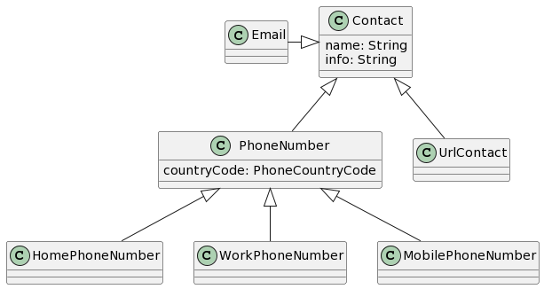
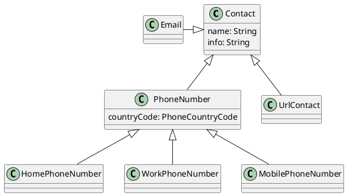

# TACS 22/23 - CV Maker - assignment 1

## Group members

- [Ana Inês Oliveira de Barros <up201806593@fe.up.pt>](up201806593@fe.up.pt)
- [João Alexandre Lobo Cardoso <up201806531@fe.up.pt>](up201806531@fe.up.pt)
- [João de Jesus Costa <up201806560@fe.up.pt>](up201806560@fe.up.pt)

## Design decisions

### Enums' _unset_ element

Many times enums are optional. When this happens it's important to include a
default _unset_ value for the enums. This is a value meaning that the enum
instance doesn't have any value set. This is because enums in the generated code
can't be set to `null`.

### (Sub)section's names

Section can contain subsections (recursively). We enforced that each section's
name should be unique within its siblings. This allows tree structures with
names like the following:

```txt
   SectionLayer
    /        \
Section1  Section2
   |          |
 Name       Name
```

But not like the following:

```txt
  SectionLayer
   /        \
Section   Section
```

**Note:** Sections can't contain themselves (as subsections). This restriction
is applied recursively. This forbids cycles on the tree structure.

### Section and content ordering

The user is able to order both sections and their content arbitrarily (within
their parent). To achieve this, we created an `Orderable` interface, which they
implement.

All `Orderable` sections/content have an integer representing their order. These
integers are forced to be higher than 0, unique within their parent, and always
in sequence (e.g., 1, 2, 3, etc...).

**Note:** The `IdentificationSection` is the only _non-orderable_ section. This
is the only mandatory section, and it always appears in the first position
(before the rest) of the document.

### Contacts

A `Contact` is composed by a name and the contact itself (_info_). We defined
some commonly used types of contacts: phone number (which takes a country code),
email and url. This way, it is possible to take advantage of the pre-created
types or to the create another type of contact that might be missing.





### Time frames

Usually, work experience is accompanied by a time frame (start date - end date).
For this reason, we created the abstract class `TimeFrame` that contains a
_startDate_. Then, there is `StartEndTimeFrame` extending `TimeFrame` for cases
where the final date of the experience is known, and `TimeFrameDateValid` to be
used when the experience is still ongoing.

At first, we wanted to use `null` for the **end date** to signal that it was an
_ongoing_ time frame, but this caused problems with OCL restrictions: OCL
comparisons against `null` were generating semantically incorrect code. We
aren't sure why this was happening, but it happened with code snippets from the
documentation about `null` comparisons as well.

## Concept tables

| Concept | Intrinsic Properties | Extrinsic Properties             |
| ------- | -------------------- | -------------------------------- |
| CV      |                      | sectionLayer: One `SectionLayer` |

### `order` package

| Concept                   | Intrinsic Properties | Extrinsic Properties |
| ------------------------- | -------------------- | -------------------- |
| `Orderable` _(interface)_ | order: int           |                      |

### `content` package

| Concept                                    | Intrinsic Properties                                         | Extrinsic Properties                                         |
| ------------------------------------------ | ------------------------------------------------------------ | ------------------------------------------------------------ |
| `Content` _(extends: Orderable)_           | name: String<br />description: String _(optional)_ <br />url: String _(optional)_ | files: Arbitrary number of `File`<br />timeFrame: Optional `TimeFrame`<br />address: Optional `Address` |
| `File`                                     | path: String<br />createdDate: Date                          | type: `FileType` _(Enum)_                                    |
| `FileType ` _(enum)_                       | `PDF` \| `PNG` \| `JPG` \| `SVG`                             |                                                              |
| `TimeFrame` _(abstract)_                   | startDate: Date                                              |                                                              |
| `StartEndTimeFrame` _(extends: TimeFrame)_ | endDate: Date                                                |                                                              |
| `OnGoingTimeFrame` _(extends: TimeFrame)_  |                                                              |                                                              |
| `Address`                                  | line1: String _(optional)_<br />line2: String _(optional)_<br />postalCode: String (optional)<br />city: String _(optional)_<br />country: String |                                                              |

### `section` package

| Concept                                              | Intrinsic Properties | Extrinsic Properties                               |
| ---------------------------------------------------- | -------------------- | -------------------------------------------------- |
| `SectionContainer` _(abstract)_                      |                      | sections: Arbitrary number of `Section`            |
| `Section` _(abstract)_ _(extends: SectionContainer)_ | name: String         | content: Arbitrary number of `Content`             |
| `OrderedSection` _(extends: Section, Orderable)_     |                      |                                                    |
| `SectionLayer` _(extends: SectionLayer)_             |                      | identificationSection: One `IdentificationSection` |

### `workexp` package

| Concept                                             | Intrinsic Properties                                         | Extrinsic Properties                                        |
| --------------------------------------------------- | ------------------------------------------------------------ | ----------------------------------------------------------- |
| `WorkExperienceSection` _(extends: OrderedSection)_ |                                                              | workExperiences: One or more `WorkExperience`               |
| `WorkExperience`                                    | occupation: String<br />employer: String<br />description: String _(optional)_ | timeFrame: One `TimeFrame`<br />address: Optional `Address` |

### `edutrain` package

| Concept                                                | Intrinsic Properties                                         | Extrinsic Properties                                         |
| ------------------------------------------------------ | ------------------------------------------------------------ | ------------------------------------------------------------ |
| `EducationTrainingSection` _(extends: OrderedSection)_ |                                                              | educationTraining: One or more `EducationTraining`           |
| `EducationTraining`                                    | title: String<br />organization: String _(optional)_<br />description: String _(optional)_<br />finalGrade: String _(optional)_ | fieldsOfStudy: Arbitrary number of`FieldOfStudy` _(enum)_<br />eqf: Optional `EQF` _(enum)_ |
| `FieldOfStudy` _(enum)_                                | `GENERIC` \| `EDUCATION` \| `ARTS_HUMANITIES` \| ...         |                                                              |
| `EQF` _(enum)_                                         | `EQF1` \| `EQF2` \| `EQF3` \| ...                            |                                                              |

### `identification` package

| Concept                                      | Intrinsic Properties                                         | Extrinsic Properties                                         |
| -------------------------------------------- | ------------------------------------------------------------ | ------------------------------------------------------------ |
| `IdentificationSection` _(extends: Section)_ |                                                              | One Person                                                   |
| `Person`                                     | firstNames: String<br />lastNames: String _(optional)_<br />title: String _(optional)_<br />dateOfBirth: Date _(optional)_<br />aboutMe: String _(optional)_<br />nationalities: List of String | gender: One `Gender` _(enum)_<br />maritalStatus: One `MaritalStatus` _(enum)_<br />picture: Optional `File`<br />contacts: Arbitrary number of `Contact`<br />addresses: Arbitrary number of `NamedAddress` |
| `Gender` _(enum)_                            | `MALE` \| `FEMALE` \| ...                                    |                                                              |
| `MartialStatus` _(enum)_                     | `MARRIED` \| `DIVORCED` \| `SEPARATED` \| ...                |                                                              |
| `NamedAddress` _(extends: Address)_          | name: String                                                 |                                                              |
| `HomeAddress` _(extends: NamedAddress)_      |                                                              |                                                              |
| `WorkAddress` _(extends: NamedAddress)_      |                                                              |                                                              |

#### `identification.contact` package

| Concept                                      | Intrinsic Properties                                 | Extrinsic Properties                         |
| -------------------------------------------- | ---------------------------------------------------- | -------------------------------------------- |
| `Contact`                                    | name: String<br />info: String                       |                                              |
| `Email` _(extends: Contact)_                 |                                                      |                                              |
| `PhoneNumber` _(extends: Contact)_           |                                                      | countryCode: One `PhoneCountryCode` _(enum)_ |
| `PhoneCountryCode` _(enum)_                  | `UNITED_STATES` \| `AFGHANISTAN` \| `ALBANIA` \| ... |                                              |
| `HomePhoneNumber` _(extends: PhoneNumber)_   |                                                      |                                              |
| `WorkPhoneNumber` _(extends: PhoneNumber)_   |                                                      |                                              |
| `MobilePhoneNumber` _(extends: PhoneNumber)_ |                                                      |                                              |
| `UrlContact` _(extends: Contact)_            |                                                      |                                              |

### `skill` package

| Concept                                    | Intrinsic Properties                         | Extrinsic Properties                                         |
| ------------------------------------------ | -------------------------------------------- | ------------------------------------------------------------ |
| `SkillSection` _(extends: OrderedSection)_ | softSkills: Arbitrary number of String       | hardSkills: Arbitrary number of `HardSkill`<br />motherTongues: Arbitrary number of `MotherTongue`<br />secondLanguages: Arbitrary number of `SecondLanguage` |
| `HardSkill`                                | name: String<br />proficiency: Float         |                                                              |
| `Language` _(abstract)_                    | name: String                                 |                                                              |
| `MotherTongue` _(extends: Language)_       |                                              |                                                              |
| `SecondLanguage` _(extends: Language)_     |                                              | conversation: One `LanguageSkillLevel` _(enum)_<br/>reading: One `LanguageSkillLevel` _(enum)_<br/>writting: One `LanguageSkillLevel` _(enum)_<br/>comprehension: One `LanguageSkillLevel` _(enum)_<br/>peerReview: One `LanguageSkillLevel` _(enum)_ |
| `LanguageSkillLevel` _(enum)_              | `A1` \| `A2` \| `B1` \| `B2` \| `C1` \| `C2` |                                                              |
