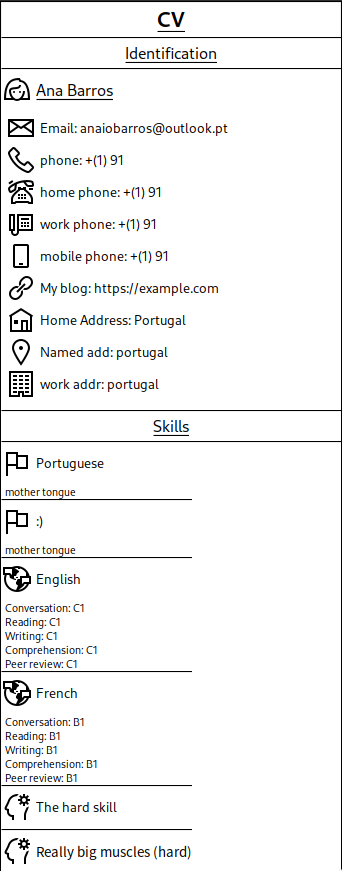
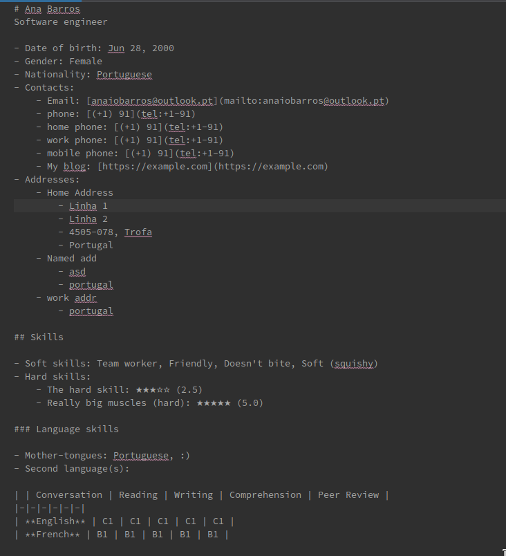

# TACS 22/23 - CV Maker - assignment 2

## Group members

- [Ana Inês Oliveira de Barros <up201806593@fe.up.pt>](up201806593@fe.up.pt)
- [João Alexandre Lobo Cardoso <up201806531@fe.up.pt>](up201806531@fe.up.pt)
- [João de Jesus Costa <up201806560@fe.up.pt>](up201806560@fe.up.pt)

## Changes to the metamodel of the first assignment

- Put everything into a single package:
  - We were already having problems with using packages, e.g., not being able to
    generate the class diagram from the metamodel.
- Make most relationships between classes have the **containment** attribute set
  to true:
  - This makes it much easier to create model instances.
- Add `TimeFrame` to `EducationTraining`:
  - This way a user can associate time frames/dates to their education,
    certifications, etc...
- Add a `parent` reference to (sub)sections:
  - Allows a (sub)section to directly see its parent section.

## Stuff about Sirius

We wanted to make the CV editor look like a paper sheet. To achieve this, most
nodes are actually containers. This allows us to display parts of the CV as
rectangles. This introduces a problem: Sirius only allows creating a container
around the target node. The problem arrives, for example, when creating
(sub)sections. To work around this, each (sub)section contains an _invisible_
container (it is not exactly invisible, but close to it) whose target object is
itself. This way, when creating a subsection, we can change context to this
inner container and create the subsection as a child of its parent, i.e., a
child of the section.

There are tools to create all objects available at each component. The tools get
disabled when it is not possible to use them, e.g., it isn't possible to create
a `TimeFrame` for a `WorkExperience` when it already has one. When
clicking/highlighting an object, the tools available to apply on that object
show up.

We created a Java service that allows us to order the sections and their
subsections: subsections appear next to their parent section. Sections are
ordered by their _order_ attribute in relation to their siblings. It is
basically a depth first search in the sections graph.

The icons in the editor change based on the type of information shown, e.g., a
home phone number has a different icon for a work phone number.

We wanted to create a dialog for users to pick files to add to the CV, but we
didn't find a way to do this. As such, users need to introduce the path to the
files manually (in a text field).

## Stuff about Acceleo

We decided to output file to Markdown given its popularity and versatility
(e.g., convert to HTML, PDF, etc.). The file is formatted according to
Markdown's guidelines.

We created some Java services for Acceleo. We had some trouble compiling them:
when the services took an argument, we had to use a sub-instance of eclipse
(where the meta-model is available as a lib). There were also some problems
where the services wouldn't recompile on change, but these were _easily_ solved
by deleting the `bin/` directory to trigger recompilation. There are method for
printing `Date` objects in the desired format, to convert the skill level of the
`HardSkills` into a sequence of stars (similar to star-rating systems), and to
obtain the integer value of enums (surprisingly, the Acceleo language doesn't
support that natively).

When we designed the meta-model, we thought we would end-up generating a PDF
file for the models. With this, we planned to incorporate user given files into
de PDF output. As such, we designed the files to be either images (PNG, JGP,
SVG) or PDF files (e.g., in latex we can include other PDF files). Since we
ended-up generating Markdown files, this plan suffered a change: now users
specify the path to the file and are responsible for placing the file there. The
generated Markdown links to these files (if the file is an image, the link shows
the image). The paths can be relative to the location of the markdown file.

## Example CVs

There are 2 example CVs (and the generated Markdown files) in the
[CVs directory](./CVs).

- [Ana Barros CV](./CVs/AnaCV.cv) - generates
  [this Markdown file](./CVs/Ana.cv.md)
  - This was the CV that server as the test during the development of the
    application.
- [Ricardo Fontão CV](./CVs/RicardoJorgeCV.cv) - generates
  [this Markdown file](./CVs/Ricardo_Jorge.cv.md)
  - This was the result of one of our friends taking their CV and _rebuilding_
    it using our application;
  - He used the CV he wrote for the Curriculum Vitae CT at FEUP.

## Problems to be address

- `EducationTraining` could have an (optional) `Address`;
- `WorkExperience` addresses can be home/work address instances:
  - This is a problem with the metamodel and could be easily fixed.
