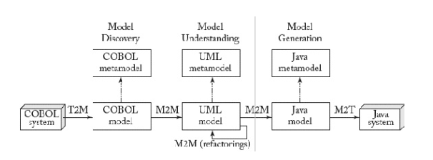

# TACS

## Abstraction

Consists of the capability of finding the commonality in many observations and
thus generating a mental representation of the reality which is at the same time
able to:

- **Generalization** - generalize specific features of real objects
- **Classification** - classify the objects into coherent clusters
- **Aggregate** - aggregate objects into more complex ones

## Purpose and use of models

- Simplifications of reality paramount to understanding the basics of some
  fields
- Models are recognized to implement at least two roles by applying abstraction:
  - Reduction feature - models only reflect a selection of the original's
    properties (focus on aspects of interest)
  - Mapping feature - models are based on an original individual, which is taken
    as a prototype of a category of individual and is abstracted and generalized
    to a model
- Modelos podem ter diferentes propositos (descriptive, predictive,
  prescriptive, normative, speculative)
- Models are everywhere. Cannot be avoided:
  - Designers can only decide about making it explicit or keeping it in their
    heads.

## Modeling for software development

- Model-Driven Software engineering (MDSE) - modelling para produzir software
  artefacts:
  - Increase efficiency and effectiveness
  - Demonstrated by studies
- Reasons why use:
  - Software artefacts are more complex `=>` need to be discussed at different
    abstraction levels depending on the profile of the stakeholders, phase of
    development process, and objectives of the work
  - Software is more present in people's lives and the need is expected to
    continuously increase
  - Job market experiences shortage of software development skills
  - Software development is not a self-standing activity. It often imposes
    interactions with non-developers, which calls for mediation in the
    description of technical aspects of development.
- Benefits organizations struggling to bridge the gap between business
  requirements and IT implementation:
  - Move to agile approaches, modelling efforts, reusable design patterns and
    frameworks

### Use of Models

- Possible usages:
  - **Models as sketches** - models are used for communication purposes. Only
    partial views of the system are specified
  - **Models as blueprints** - models are used to provide a complete and
    detailed specification of the system
  - **Models as programs** - models (instead of code) are used to develop the
    system
- Organizations can use models in different ways during a project
- Models can be refined to from one usage to the next
- `Algorithms + Data Structures = Programs` `=>`
  `Models + Transformations = Software`

## MDSE

- Diferente de desenhar - tem regras muito especificas a seguir. É rigoroso.
- Model-Driven Development (MDD) < Model-Driven Engineering (MDE) < Model-based
  Engineering (MBE)

### MDSE methodology

- Implementation (rows):
  - Modeling level - where models are defined
  - Automation level - mapping from modeling to realization
  - Realization level - where solutions are implemented (code in case of
    software)
- Conceptualization (columns):
  - Application level - where models of the applications are defined,
    transformation rules performed, and actual running components generated
  - Application domain level - where the definition of the modeling language,
    transformations, and implementation platforms for a specific domain are
    defined
  - Meta-level - where conceptualization of models and of transformations are
    defined

### Static & Dynamic models

The two main dimensions of a system. The different views of to address the
dimensions separately. MDSE may lead to building various models describing the
same solution.

- **Static models** - focus on the static (structural) aspects of the system:
  managed data, structural shape, and architecture of the system
- **Dynamic models** - emphasize the dynamic behavior of the system by showing
  the execution sequence of actions and algorithms, the interactions among
  components, and the changes to the internal state of the application

### Metamodels & meta-metamodel

- Ecore é metamodel
- Ecore é o seu próprio metamodel tmb `=>` meta-metamodel

### Modelware

- UML define metamodel. MOF é o meta-metamodel do UML
- Domain-Specific Modeling Language (DSML) - HTML, SQL
- General-Purpose Modeling Language (GPML) - UML, Petro-nets

### Aggregation vs Composition

- Composition - `-*` - strong-lifecycle dependency. Imposes a parent-child
  relationship.
- Aggregation - `-o` - weak-lifecycle dependency. Doesn't impose a parent-child
  relationship.

### Transformations

- Defined at the metamodel level
- Applied at the model level (applied at the model level)
- Can be seen as models, and managed as such, including their metamodeling.
- Not all modelling tools are drawing tools and vice-versa:
  - Drawing tools may allow drawing models, but they need to understand it to be
    considered modeling tools (validate the model as a correct instance of the
    metamodel).

### Criticisms

- Não é usado na em prática na industria
- Inflated expectations estragam adoção da tech (causado pela popularização de
  UML):
  - Vendido como silver bullet para software development
- Agora já é visto como algo que tem que ser decidido para certos tipos de
  projetos

## Use cases

### Executable model

- Executable model - model complete enough to be executable
- Theoretically, a model is executable when its operational semantics are fully
  specified.
- In practice, the executability of a model may depend more on the adopted
  execution engine than on the model itself.
- Cool for data-intensive applications
- Example: Executable UML

### Code generation

#### Partial vs. Full generation

- When input models are not complete and the code generator is not smart enough
  to derive or guess the missing information, we can still benefit from a code
  generation approach by creating a partial implementation of the system
- Partial generation means that programmers will need to complete the code
  manually to obtain a fully functional systems.
- Having the same info in 2 places (code and models) is a recipe for trouble.
  Mitigate by:
  - Should define protected areas
  - Use round-trip engineering tool
  - Focus on full generation of parts of the system instead of partial
    generation of full system
- Important to generate the smallest amount of code to achieve the desired
  functionality:
  - Should rely on all kinds of existing frameworks, APIs, components, or
    libraries

#### Advantages of code generation

- Protects the intellectual property of the modeler
- The generated implementation is model and process agnostic `=>` easier to
  understand
- Code generation allows customers to choose their runtime environment `=>`
  avoid risk of vendor lock-in
- Can target a specific architecture based on the needs or legacy solution that
  the customer has in house
- Flexibility in the deployment of the generated code facilitates customers
  being compliant to their IT architecture policies and to other rules
- Code generation allows reusing existing programming artifacts. In particular,
  existing pieces of code can be generalized and used as templates for code
  generation
- A code generator is usually easier to maintain, debug, and track because it
  typically consists of rule-based transformations. While an interpreter has a
  generic and complex behavior to cover all the possible execution cases
- Possibility of following a partial generation approach
- Better performance.

#### Disadvantages of code generation

- Code does not look "familiar" to the developers:
  - Even if it behaves exactly as expected and is written in the programming
    language of choice
- Could be very different from the code that actual programmers would write:
  - Makes them reluctant to accept it
  - May be useful to define a Turing test for code generation tools

### Model interpretation

- Model interpretation does not generate code from a model to create a working
  software application.
- Generic engine is implemented which parses and executes the model on the fly
  with an interpretation approach

#### Advantages

- Enables faster changes in the model (does not require any explicit code
  generation step).
- It even allows changing the model at runtime without stopping the running
  application
- Enables portability of applications (VM style)
- Doesn't need source code
- Enables the empowerment or modification of the behavior of the running
  application by updating the interpreter (keeping the same modes)
- Provides a higher level of abstraction upon the system
- Allows easy debugging of models at runtime, because interpretation can proceed
  step by step (natural for interpreter, but much harder on executable
  application)
- No deployment phase is needed

#### Disadvantages

- Need of interpreter scares developers:
  - Source code of the app not available
  - Vendor lock-in to the interpreter
  - New proprietary install

### Combining code gen and model interpretation

- Both used in practice
- For example, interpretation for debug and code generation for production
- Can use internal code generation (hidden from developer) but provide
  interpretation facilities
- Can provide a code generation oriented strategy that relies on predefined
  runtime components or frameworks to drastically reduce the amount of code to
  be generated

### System interoperability

Make the bridges between systems explicit

Steps:

1. Injection (text-to-model)
2. Transformation (model-to-model)
3. Extraction (model-to-text)

- Domain knowledge is specified in the transformation part
- The projection parts only deal with technical/syntactical details (mainly
  concerning the storage formats)
- Both projections and transformations can either be atomic or composite (i.e.
  chains of transformations)
- In most cases, such transformation chains are actually required in order to be
  able to split the overall problem into simpler ones

#### Syntactic mapping

- Using models to communicate between systems/components - **projectors**
- Move from heterogeneous languages (e.g. JSON) to homogeneous (e.g. MDSE)
- Can be written in general-purpose languages or with
  model-to-text/text-to-model transformations
- **Projectors**:
  - **Injectors** - inject the content of input files as models. E.g. transform
    file `a1` into model `a1`
  - **Extractors** - allow extracting the content of models as output files
    using dedicated formats. E.g. generate output file `b1` from model `b1`

#### Semantic mapping

- Aligns the concepts coming from the domains of both systems.
- Implemented as model-to-model transformation.

### Reverse engineering

- Evolving/replacing legacy systems implies studying/understanding their
  architecture, functionalities, handled data, and business rules and processes
- **Reverse engineering** - obtain higher-level representation of legacy systems
- MDRE - support for the comprehension of existing systems thanks to the use of
  model-based representations of those systems:
  - Objective is to create a set of models that represent the system
  - Models can be used for different purposes, e.g., metrics, quality assurance
    computation, documentation generation, or first step in a software
    evolution/modernization process

#### MDRE phases

- Model discovery - move as soon as possible from heterogeneous real world
  (legacy system) to the homogeneous world of models (all artefacts are
  represented as a set of interrelated models):
  - Start by creating a set of initial models that represent the legacy system
    at the same low abstraction level (Raw models)
- Model understanding - obtain higher-level views of the raw models to
  facilitate their analysis, comprehension, and later regeneration.
- Model (re)generation - the processed models obtained at the end of the model
  understanding phase are used to generate/display the expected outcome of the
  RE process (e.g. the code of a refactored version of the system)

### Modeling the organization

- Explicit formal business processes
- Allows analyzing the processes (performance, improvement, finding bottlenecks,
  ...)
- Easier for people to follow and manage the processes

## Abstract syntax

- Modeling constraints are only partially described (e.g. associations
  multiplicity)
- Additional (complex) constraints may be defined using a constraint language
  (e.g. OCL)
- metamodel + constraints = abstract syntax

### Abstract syntax development

Having an explicit metamodel conforming to a standardized meta-metamodel comes
with benefit:

- Precise language definition: formal definition of the language's syntax which
  is processable by machines. E.g. use metamodels to check if models are valid
  instances
- Accessible language definition: if metamodel is based on a well-known modeling
  language, knowledge of such language is sufficient to read and understand the
  modeling language definitions in the form of metamodels
- Evolvable language definition: metamodels may be subject to modifications.
  Having an accessible language definition contributes to an easy adaptation of
  modeling languages based on metamodels

Generic tool, which are metamodel-agnostic, may be developed based on the
meta-metamodel level:

- E.g. EMF provides sophisticated reflection techniques to develop programs
  which are applicable to all instances of metamodels
- Exchange formats: based on the meta-metamodel, there is support to
  serialize/deserialize models into XML documents (exchangeable between tools)
- Model repositories: models may be stored to and retrieved from a model
  repository based on generic storage/loading functionalities
- Model editors: for modifying models, generic editors may be provided which are
  applicable on all models

## Metamodel development process

1. Modeling domain analysis - purpose, realization, and content of the language
2. Modeling language design - use metamodeling lang to formalize modeling
   concepts by modeling the abstract syntax of the lang and constraints using
   OCL
3. Modeling language validation - metamodel is instantiated by modeling the
   examples to validate the completeness and correctness of the metamodel

## M2M Transformations

- **Exogenous transformation** - between models of 2 different languages. E.g.
  UML to Java (vertical):
  - Can also be horizontal. E.g. UML to ER
- **Endogenous transformation** - model with the same language. E.g. model
  refactoring
- **Out-place transformation** - generating the output model from scratch.
  Especially suited for exogenous transformation
- **In-place transformation** - rewriting a model by creating, deleting, and
  updating elements in the input model. Suitable for endogenous transformations
  such as refactorings
